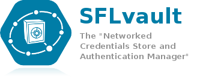

**Warning: This application is not maintained anymore, therefore cannot be considered secure.**

Welcome to SFLvault |badge|
-------------------
.. |badge| image:: https://api.travis-ci.org/savoirfairelinux/sflvault.png?branch=master
SFLvault is a Networked credentials store and authentication manager.

It has a client/vault (server) architecture allowing to cryptographically store and organise loads of passwords for different machines and services.

Documentation
-------------
To learn more about the project, please visit `the project's website <http://www.sflvault.org>`_

Issue tracking
--------------
Although pull requests and documented Github issues are always appreciated, the official issue tracking is done on `Savoir-faire Linux's Redmine platform <http://projects.savoirfairelinux.com>`_.

Contributions
-------------
If you are interested in contributing to this project, feel free to fork this repository.

You can join us on #sflvault on freenode, or subscribe to our `mailing list <http://lists.savoirfairelinux.net/mailman/listinfo/sflvault>`_
