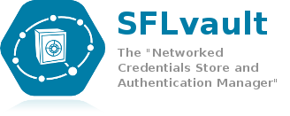

Welcome to SFLvault |badge|
-------------------
.. |badge| image:: https://api.travis-ci.org/savoirfairelinux/sflvault.png?branch=master
SFLvault is a Networked credentials store and authentication manager.

It has a client/vault (server) architecture allowing to cryptographically store and organise loads of passwords for different machines and services.

Contributions
-------------
If you are interested in contributing to this project, feel free to fork this repository.

