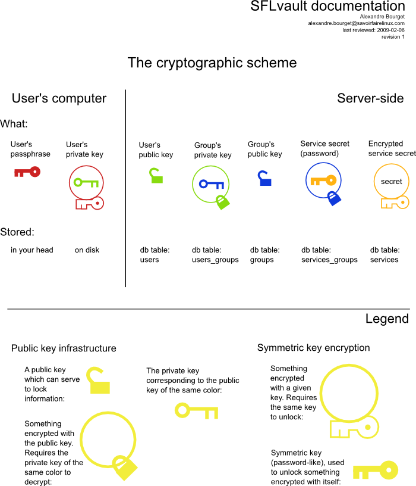

============
Architecture
============

This page overviews how SFLvault is built, and outlines the major components' functionalities.

Password store structure
========================

Three objects define the global structure of your data store: Customers, Machines and Services.

Customers
---------

Simply the name of the Customer, or any big division.

Machines
--------

One per machine, with a name, some notes, a location, a FQDN, an IP address.

This can be any machine, which supposedly has Internet access: a UPS, a DRAC connection, any server,
a desktop machine, a wireless router, etc..

Services
--------

Services are URLs, for example:

* ssh://root@this.machine.example.com
    * sudo://
        * mysql://myuser@localhost/database

One service can be child of another service (like sudo:// can and must be child of an ssh:// service).

This allows for the :doc:`automatic connection </features>` to happen (``sflvault connect``)

Users and Groups
================

Each Service is part of one or more Groups, and each User is part of one or more Groups, thus
allowing a very flexible way to manage your permissions.

Client / Server architecture
============================

The Vault is accessed via the XML-RPC protocol over HTTPS, and the authentication is done by
challenging the client.

Authentication
--------------

First, the **client** issues a ``login`` call, with the presumed user he is.

The **server** then generates a random 32 bytes string and encrypts it with the user's public key
(which was stored in it's database upon user setup). It stores it in temporary memory and sends the
reply back to the client.

The **client** must then decrypt the challenge, and sends it back in an ``authenticate`` request, to
prove he is really the one owning the private key associated with the public key.

The **server** validates the challenge token, and issues a new ``authtok``: a quick-expiration token
which is a bit like a cookie, over normal web applications.

The **client** uses that ``authtok`` to send the requests he desires (``search``, ``show``,
``list-users``, ``list-services``, etc..)

Cryptography
============

Cryptography was one of the first goals in building SFLvault. The goal was to make a responsible use
of passwords and credentials given to use by customers, so cryptography was most critical.

The cryptography model in SFLvault mimics a lot of GPG (PGP). It uses shared ElGamal keys for
encryption (one per user) and AES-256 for symmetric encryptions, exactly the same as GPG when
encrypting a message for multiple recipients (gpg -r one -r two -r three).

User's shared-keys
------------------

Each user has an ElGamal public and private keys. The public key is sent to the server and stored in
the database, associated with that user. The private key is stored on the user's computer
(in @~/.sflvault/config@ by default), encrypted with the Blowfish algorithm and a pass-phrase.

The Vault has no way to decrypt anything inside it's database, the only way to decrypt stuff, is by
sending it to the client, which has the private key to decrypt the group's private key, which in
turn can decrypt the SYMKEY, and is then used to decrypt the AES-256 secret (see below).

Password by service, keypair by group
-------------------------------------

Each service has a ``secret`` associated with it, and each group has a keypair.

When the ``secret`` is first received, a random-generated SYMKEY is generated (32 random bytes), and
that SYMKEY is used to encrypt the @secret@ with the AES-256 algorithm. This encrypted secret is
stored and associated with the service. From now, to reveal the original ``secret`` that SYMKEY will
be required.

Then, for each group, an ElGamal keypair is generated. The public key is stored with the group, and
the group's private key is encrypted with each member's user public key. Now, the user's private key
will be required to reveal the group's ``private key``.

Now, the user's private key will allow decryption of the group's private key. The group's private
key will allow the decryption of the SYMKEY for a service, and the SYMKEY will give access to the
``secret``, the actual password. This ensures no user has accidental access to a group, and no
service has accidental membership to a group. Everything is cryptographically secured.

Cryptographic scheme overview
=============================

